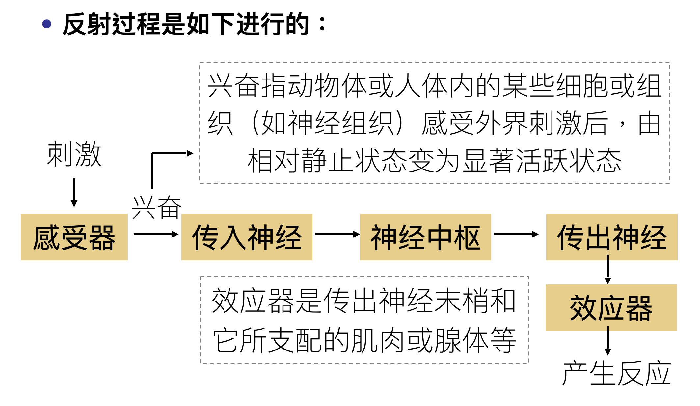

# BIOL-3

## 神经调节的基本方式

### 反射

**反射**是指在中枢神经系统参与下，机体对内、外界环境刺激所产生的规律性应答反应

- 膝跳反射

  二元反射：感觉神经元、运动神经元

- 缩手反射

  三元反射：感觉神经元、中间神经元、运动神经元

**反射弧**是反射的结构基础，包括：感受器、传入神经、神经中枢、传出神经和效应器

> - 兴奋除了在反射弧中传导，还会在脑与脊髓等中枢神经系统中传导，如从脊髓的低级中枢传导到大脑皮层
> - **反射活动需要完整的反射弧来实现**，任何环节在结构或功能上受损，反射就不能完成

|非条件反射|条件反射|
|-|-|
|先天的|后天习得的|
|由非条件刺激即直接刺激引起|由条件刺激即信号刺激引起|
|无需大脑皮层，通过皮层下各级中枢就可形成|主要中枢部位在大脑皮层|
|属于低级的神经活动|属于高级的神经活动|
|数量有限|数量无限|
|终生的，固定的|暂时的，可建立也可消退|
|生存的根本保证|扩大了适应能力|
|膝跳反射、眨眼反射、缩手反射、婴儿的吮乳、排尿反射、吃了梅子后流口水|望梅止渴|

> - 条件反射以非条件反射为基础
> - 条件反射和非条件反射共同作用，使生物更好适应环境

1904 年，俄罗斯生理学家**巴普洛夫**因其对条件反射的开创性研究而获得诺贝尔生理学或医学奖

## 神经冲动的产生和传导

### 兴奋在神经纤维的传导

反射过程即是兴奋传导的过程

#### 静息电位

- 静息状态下膜是带电的

- 细胞未受刺激时，存在于细胞膜内外两侧的电位差，叫做**静息电位**（Resting Potential, RP）

- 由于这一电位差存在于安静细胞膜的两侧，故亦称跨膜静息电位，简称**静息电位**或**膜电位**

- 静息电位都表现为**膜内比膜外电位低**，即**膜内带负电**而**膜外带正电**。这种**内负外正的状态**，称为**极化状态**

- 动物的神经纤维和各种肌肉细胞的膜电位为 50-100mV，膜内为负、膜外为正。通常把膜外电位规定为 0，则膜内电位 -50 至 -100mV

  哺乳动物的神经细胞的静息电位为 -70mV，骨骼肌细胞为 -90mV，人红细胞为 -10mV

#### 动作电位

**动作电位**（Action potential, AP）：细胞受刺激时，产生的膜两侧的快速、可逆，并能扩散的电位，称为动作电位

- **极化**：静息电位时膜两侧保持的内负外正的状态
- **去极化**：静息电位向膜内负值减小的方向变化
- **反极化**：膜内电位由零变为正值的过程
- **复极化**：去极化、反极化后恢复到静息电位水平
- **超极化**：膜内外电位差增大，极化状态加强

神经传导就是动作电位沿神经纤维的顺序发生

- 动作电位的出现非常快，每一动作电位大约只有1ms的时间，并且是“**全或无**”的，也就是说，刺激不够强时，不发生动作电位，也就没有神经冲动

- 刺激一旦达到最低有效强度，动作电位就会发生并从刺激点向两边蔓延，这就是神经冲动；而**增加刺激强度不会使神经冲动的强度和传导速度增加**

- 神经冲动在神经纤维上是双向传导的，但是由于在动物体内，神经接受刺激的地方是神经末端，因而**神经冲动只能朝一个方向传播**；并且，更重要的是**在神经纤维彼此接头的地方（化学突触），神经冲动是单向传导的，来自相反方向的冲动不能通过，因而神经冲动只能朝一个方向运行**
