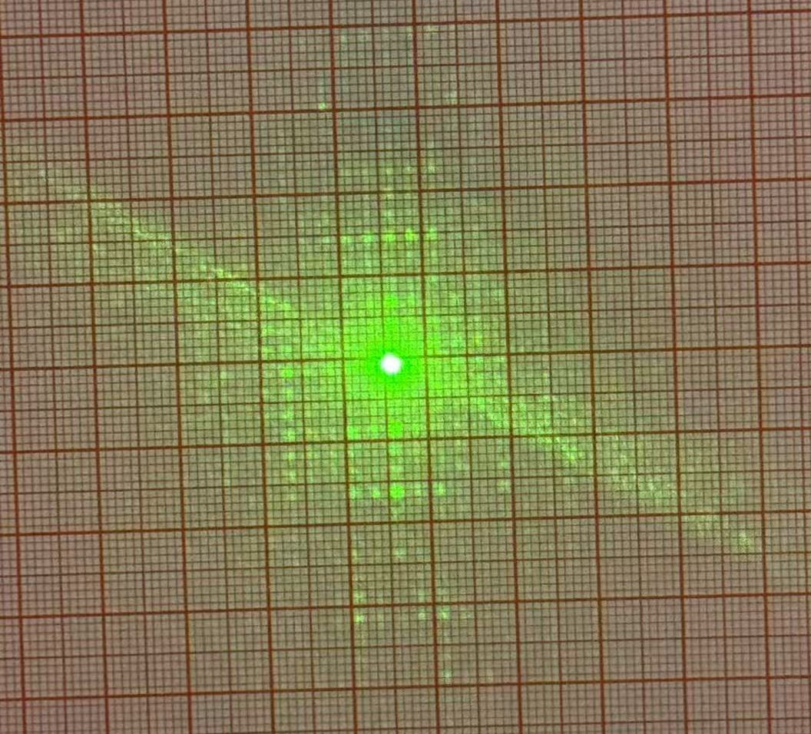

# 物理实验四 光栅方程的应用

| 姓名   | 王博想     | 学号  | 2233316027 | 班级  | 2308           | 小组号 | 1      |
| ---- | ------- | --- | ---------- | --- | -------------- | --- | ------ |
| 同组人员 | 饶宇帆 陈禹霖 | 日期  | 2025.4.24  | 温度  | $28.0^\circ C$ | 湿度  | $57\%$ |

## 实验目的

1.  掌握光栅衍射的基本原理和光栅方程的应用

2.  学习使用光栅测量激光波长、光盘光轨间距和手机屏幕分辨率

3.  分析实验误差并提出改进方案

## 实验仪器

光栅（$d=1/300\text{mm}$）、激光笔（绿光 $532\text{nm}$）、米尺、接收屏、CD 光盘、iPhone 8 plus 手机（分辨率 $1920\times 1080\text{px}$）、直尺

## 实验原理

光栅衍射的基本方程为：

$$
d\sin\theta = k\lambda \quad (k=0,\pm1,\pm2,...)
$$

其中为 $d$ 光栅常数，$\theta$ 为衍射角，$k$ 为衍射级数，$\lambda$ 为入射光波长。

对于小角度衍射，有近似关系：

$$
\sin\theta \approx \tan\theta = \frac{x_k}{L}
$$

其中 $x_{k}$ 为第 $k$ 级衍射光斑到中央亮纹的距离，$L$ 为光栅到接收屏的距离。

## 实验内容与数据处理

### 米尺测量激光波长（逐差法）

光栅常数 $d=1 / 300 \text{mm}$，光栅到接收屏距离 $L=100 \text{cm}$。

实验数据见如下表，使用逐差法处理：

| 测量级数  | $-2$    | $-1$    | $0$   | $+1$   | $+2$   | 平均间距   |
| ----- | ----- | ----- | --- | ---- | ---- | ------ |
| 位置/$\text{cm}$ | $-33.5$ | $-16.2$ | $0$   | $17.0$ | $33.6$ | $33.375$ |

逐差法计算过程：

$$
\begin{aligned}
&\Delta x_1 = x_{+1} - x_{-1} = 17.0 - (-16.2) = 33.2\,\text{(cm)} \\[10pt]
&\Delta x_2 = \dfrac{x_{+2} - x_{-2}}{2} = \dfrac{33.6 - (-33.5)}{2} = 33.55\,\text{(cm)} \\[10pt]
&\overline{\Delta x} = \dfrac{\Delta x_{1}+\Delta x_{2}}{2} = \frac{33.2 + 33.55}{2} = 33.375\,\text{(cm)} \\[10pt]
&\lambda = \frac{d\cdot\overline{\Delta x}}{k\cdot L} = \frac{3.333\times10^{-6} \times 0.33375}{2 \times 1.00} = 5.56\times10^{-7}\,\text{(m)} = 556\,\text{(nm)}
\end{aligned}
$$

与标称值 $532\text{nm}$ 的偏差：

$$
\text{相对误差} = \frac{556-532}{532} \times 100\% \approx 4.5\%
$$

### 光盘光轨间距测量（逐差法）

使用绿光 $\lambda = 532 \text{nm}$，CD 衍射数据见表 2，$L=42\text{cm}$。

CD 衍射光斑位置测量数据如下表，使用逐差法处理

| 测量级数 |   $-2$   |   $-1$ |    $0$  |  $+1$  |  $+2$  |  平均间距|
|-|-|-|-|-|-|-|
|位置/$\text{cm}$   | $-39.5$  | $-17.3$|   $0$  | $15.5$   |$39.3$ |    $36.1$|

逐差法计算过程： 

$$
\begin{aligned}
\Delta x_1 &= x_{+1} - x_{-1} = 15.5 - (-17.3) = 32.8\,\text{cm} \\
\Delta x_2 &= (x_{+2} - x_{-2})/2 = (39.3 - (-39.5))/2 = 39.4\,\text{cm} \\
\overline{\Delta x} &= \frac{32.8 + 39.4}{2} = 36.1\,\text{cm} \\
d &= \frac{k\lambda L}{\overline{\Delta x}} = \frac{2 \times 5.32\times10^{-7} \times 0.42}{0.361} \approx 1.24\,\mu\text{m}
\end{aligned}
$$

### 手机分辨率的测量

手机型号：iPhone 8 plus，标称分辨率 $1920 \times1080 \text{px}$，$\lambda=532\text{nm}$，$D=30.0\text{cm}$。
屏幕显示区尺寸：长 $a=121.0\text{mm}$，宽 $b=68.0\text{mm}$。

实验步骤：

1.  测量手机显示屏的长 $a$ 和宽 $b$

2.  将手机屏幕与坐标纸平行相隔距离 $D$

3.  将激光笔尽量贴近手机屏，以小角度使光通过手机屏在坐标纸上形成衍射光斑

4.  拍照记录，处理数据

根据手机屏幕衍射结果，观察得相邻斑点距离约为 $2.5\text{mm}$

通过以上测量，计算像素间距：

$$
\begin{aligned}
    \Delta x &= 2.5\,\text{mm} \\
    d_h &= \frac{\lambda D}{\Delta x} = \frac{532\times10^{-6}\,\text{mm}\times300\,\text{mm}}{2.5\,\text{mm}} = 63.8\,\mu\text{m}
\end{aligned}
$$

计算像素间距：

$$
\text{水平方向} = \frac{a}{1920} = \frac{121.0\text{mm}}{1920} \approx 63.02\mathrm{\mu m}
$$

$$
\text{垂直方向} = \frac{b}{1080} = \frac{68.0\text{mm}}{1080} \approx 62.96\mathrm{\mu m}
$$

由此得到，实验结果与理论值较为符合

## 误差分析

- **激光波长测量**：条纹位置读数粗糙；光栅与屏幕未完全对准；环境光干扰。
    
- **CD 轨道间距**：入射角度偏离理想；光盘表面不规则。
    
- **手机分辨率测量**：实验距离测量不精准；Pentile 排列导致实际周期偏大；屏幕防反射涂层影响衍射。

## 改进方案与建议

- 使用游标卡尺等高精度测量工具
    
- 在暗室或加装遮光装置，减小环境光影响
    
- 通过调节支架保证光栅与屏幕平行对齐
    
- 多次重复测量并取平均值
    
- 手机屏幕测试时可使用标准网格图案以提高精度

## 结论

验证了光栅方程的正确性，成功测量了：

-   绿光波长为 $567\text{nm}$ 误差 $4.5\%$

-   CD 刻轨间距约为 $1.24\mathrm{\mu m}$

-   iPhone 8 plus 手机像素间距：实验值 $63.8\mathrm{\mu m}$，与水平理论值 $63.02\mathrm{\mu m}$ 和垂直理论值 $62.96\mathrm{\mu m}$ 高度一致

实验数据基本合理，误差在可接受范围内，验证了光栅衍射原理的实际应用价值。
