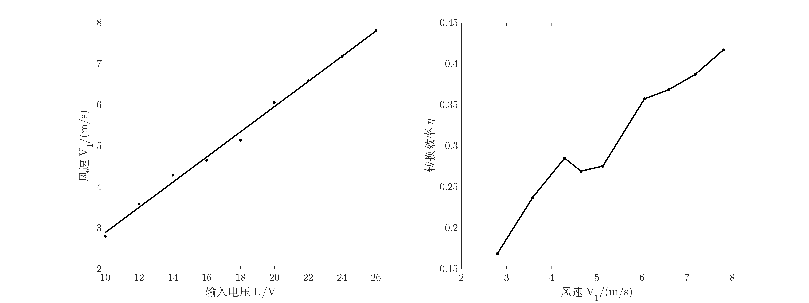
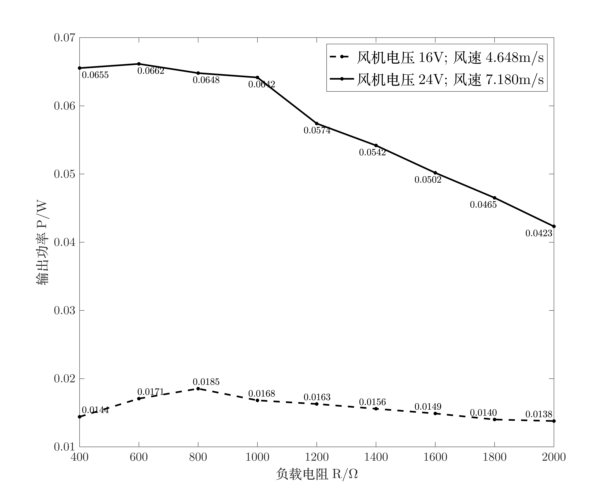
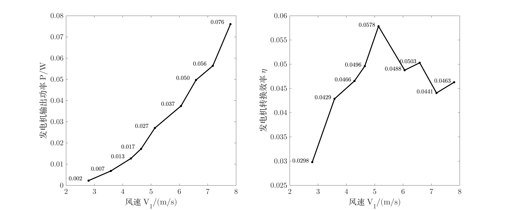

# 物理实验五 风能电能转换研究

| 姓名   | 王博想     | 学号  | 2233316027 | 班级  | 2308           | 小组号 | 3      |
| ---- | ------- | --- | ---------- | --- | -------------- | --- | ------ |
| 同组人员 | 薛宇恒 高玮泽 | 日期  | 2025.5.15  | 温度  | $29.8^\circ C$ | 湿度  | $56\%$ |

---

## 1. 风机电压与风速及风能的关系研究

### 实验原理

风能大小与风速的立方成正比，电能到风能的转换效率可通过计算输入电功率和风洞风能功率得出。

### 使用仪器

稳压电源，风速仪，风洞实验台

### 实验步骤

1. 将风机正负极接至稳压电源正负极，打开电源开关。
2. 调整电压，在风洞出口位置用风速仪测量不同电压时的风速。
3. 将风速值及稳压电源指示的电压电流值记录到表格中。

### 测量内容数据及处理

表1 风机电压与风速及风能的关系

| 输入电压 $U(\text{V})$       | 10    | 12    | 14    | 16    | 18    | 20    | 22    | 24    | 26    |
| ------------------------ | ----- | ----- | ----- | ----- | ----- | ----- | ----- | ----- | ----- |
| 输入电流 $I(\text{A})$       | 0.065 | 0.081 | 0.099 | 0.117 | 0.137 | 0.156 | 0.177 | 0.200 | 0.220 |
| 风速 $V_{1}(\text{m/s})$   | 2.795 | 3.582 | 4.286 | 4.648 | 5.133 | 6.056 | 6.587 | 7.180 | 7.803 |
| 输入电功率 $P_{0}(\text{W})$  | 0.650 | 0.972 | 1.386 | 1.872 | 2.466 | 3.120 | 3.894 | 4.800 | 5.720 |
| 风洞风能功率 $P_{1}(\text{W})$ | 0.110 | 0.231 | 0.395 | 0.504 | 0.679 | 1.114 | 1.434 | 1.857 | 2.384 |
| 转换效率 $(\text{\%})$       | 16.9  | 23.7  | 28.5  | 26.9  | 27.5  | 35.7  | 36.8  | 38.7  | 41.7  |

风洞直径 $=103.84\,\text{mm}$

### 规律分析

---

## 2.风力发电机输出特性实验

### 实验原理

风力发电机的输出功率与负载电阻有关，存在最佳负载使输出功率最大化。

### 使用仪器

稳压电源，风洞实验台，风力发电机，电阻箱，万用表

### 实验步骤

1. 在风洞出口安装风力发电机，测量电压为 16V 和 24V 时风力发电机输出关系。
2. 将风力发电机输出接至电阻箱，并接万用表测量电阻箱电压。
3. 打开电源开关，调整风机电压至 16V 或 24V，调整电阻箱负载电阻，记录对应电压值。

### 测量内容数据及处理

表2 风力发电机输出功率与负载电阻的关系

| 负载电阻 $R(\mathrm{\Omega})$             | 400    | 600    | 800    | 1000   | 1200   | 1400   | 1600   | 1800   | 2000   |
| ------------------------------------- | ------ | ------ | ------ | ------ | ------ | ------ | ------ | ------ | ------ |
| 电压 $U_{1}(\text{V})$                  | 2.40   | 3.20   | 3.85   | 4.10   | 4.42   | 4.67   | 4.88   | 5.02   | 5.25   |
| 输出功率 $(\text{16V})\;P_{1}(\text{W})$  | 0.0144 | 0.0171 | 0.0185 | 0.0168 | 0.0163 | 0.0156 | 0.0149 | 0.0140 | 0.0138 |
| 电压 $U_{2}(\text{V})$                  | 5.12   | 6.30   | 7.20   | 8.01   | 8.30   | 8.71   | 8.96   | 9.15   | 9.20   |
| 输出功率 $\text{(24V)}\; P_{2}(\text{W})$ | 0.0655 | 0.0662 | 0.0648 | 0.0642 | 0.0574 | 0.0542 | 0.0502 | 0.0465 | 0.0423 |

### 规律分析

---

## 3.不同风速下的风力发电机输出特性实验

### 实验原理

输出功率受风速影响，存在最大功率点，风能到电能的转换效率可衡量性能。

### 使用仪器

稳压电源，风洞实验台，万用表，风力发电机，电阻箱

### 实验步骤

1. 测量不同风机电压下，负载电压和输出功率。
2. 记录不同风机电压对应的风速。
3. 计算通过叶片风能功率和发电机转换效率。

### 测量内容数据及处理

表3 风速与风力发电机输出功率间关系（负载电荷 $1000$ 欧）

| 风机电压 $(\text{V})$      | 10    | 12    | 14    | 16    | 18    | 20    | 22    | 24    | 26    |
| ---------------------- | ----- | ----- | ----- | ----- | ----- | ----- | ----- | ----- | ----- |
| 负载电压 $(\text{V})$      | 1.50  | 2.61  | 3.56  | 4.15  | 5.20  | 6.12  | 7.05  | 7.51  | 8.72  |
| 输出功率 $(\text{W})$      | 0.002 | 0.007 | 0.013 | 0.017 | 0.027 | 0.037 | 0.050 | 0.056 | 0.076 |
| 风速 $V_{1}(\text{m/s})$ | 2.795 | 3.582 | 4.286 | 4.648 | 5.133 | 6.056 | 6.587 | 7.180 | 7.803 |
| 通过叶片风能功率 $(\text{W})$  | 0.075 | 0.159 | 0.272 | 0.347 | 0.468 | 0.768 | 0.988 | 1.280 | 1.643 |
| 发电机转换效率 $(\text{\%})$  | 2.98  | 4.29  | 4.66  | 4.96  | 5.78  | 4.88  | 5.03  | 4.41  | 4.63  |

叶片直径 $=86.20\,\text{mm}$

### 规律分析

--- 

## 误差分析改进方案及建议

